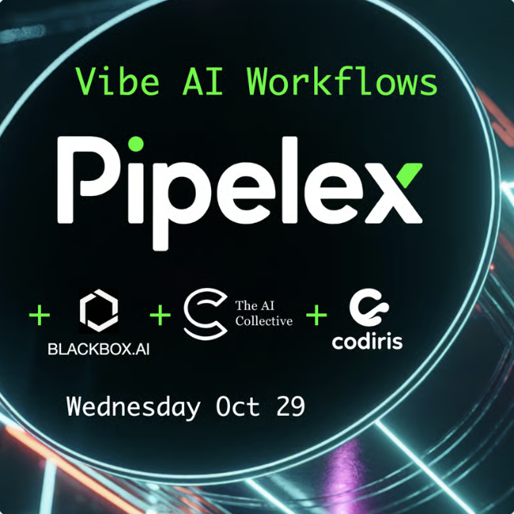
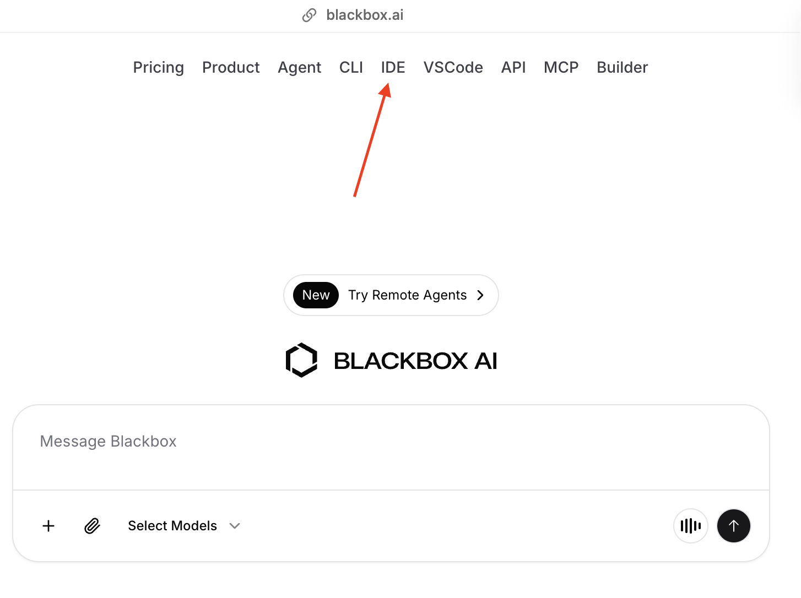
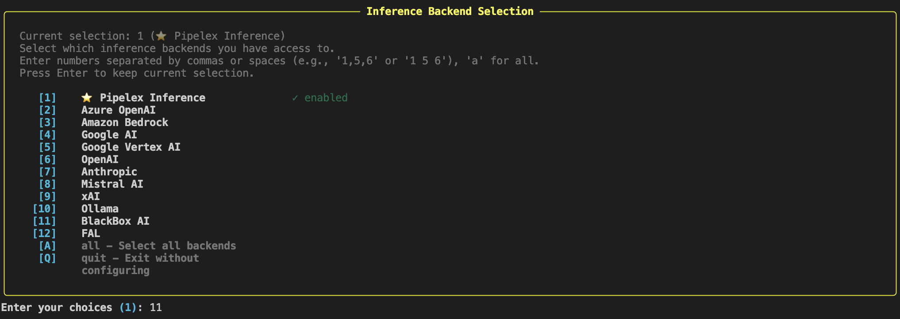

<div align="center">
  
</div>

# Hackathon - Do the impossible with AI

We are happy to welcome you to our hackathon to celebrate our first official launch!! 🎉

- Don't hesitate to give us some feedback, and a star 🌟 on github! [--> RIGHT HERE <--](https://github.com/Pipelex/pipelex)
- You can also bump a like 🤝 on devhunt [--> RIGHT HERE <--](https://devhunt.org/)

**Organized in partnership with:**
- [BlackboxAI](https://www.blackboxai.com/) - BlackboxAI is the world’s most advanced AI coding ecosystem, with an IDE.
- [Codiris](https://www.codiris.build/) - AI-native Product Development Environment
- [The AI Collective](https://www.aicollective.com/) - A non-profit, grassroots community uniting 100,000+ pioneers – founders, researchers, operators, and investors – exploring the frontier of AI in major tech hubs worldwide

---

## Resources

### Support

Since we are in early stage, you might encounter issues. Don't hesitate to reach out to us for debugging

- **Support Channel:** [join our discord](https://go.pipelex.com/discord). We have created a channel for the hackathon.
- Look for Thomas, Louis or Robin. We have Pipelex merch and a french accent, you can't miss us.

### Documentation

- **Documentation:** [https://docs.pipelex.com]
- **API Reference:** [https://docs.pipelex.com/pages/api/]

---

## ⚠️⚠️⚠️ IMPORTANT: Focus on ONE Feature! ⚠️⚠️⚠️

**You have only 2 hours and 30 minutes.**

- Pick ONE concrete problem to solve.
- Think about the data right from the beginning.
- Build ONE workflow that actually works
- Integrate it into a simple, functional app
- Make it demo-ready

**Remember:** A single feature that works beautifully is infinitely better than five half-baked ideas. Focus, ship, and shine! 🎯

## Setup

### Getting Started

### STEP 0: Install BlackBox IDE (Required for Everyone!)

- Signup to [blackbox.ai](https://www.blackbox.ai/)
- Before you start building, you need to install the **BlackBox IDE** - your AI-powered development environment.

[Download the BlackBox IDE](https://docs.blackbox.ai/features/desktop-agent/getting-started#1-download)

---



---

### OPTION 1 (Easiest - less setup): Python Frontend

Build your frontend with **Streamlit** or **Gradio** or else.

**Step 1: Install Pipelex**

```bash
python3 -m venv .venv
source .venv/bin/activate
pip install pipelex
```

**Step 2: Configure your environment variables**

Create a `.env` file in your project directory and add your BlackboxAI API key:
If you don't have one, come to us.
```
BLACKBOX_API_KEY=your_blackbox_api_key
```

**Step 3: Initialize Pipelex**

```bash
pipelex init
```

When it comes to choosing the backend, choose "BlackboxAI" (number 11).



**Step 4: Configure the routing profile**

Open the file `.pipelex/inference/routing_profiles.toml` and modify the `active` value:

```toml
active = "all_blackboxai"
```

**Step 5: Verify your setup**

```bash
pipelex doctor
```

**Step 6: Import the rules**

You need the blackbox rules to be imported in your workspace.
To do so, run the following command:

```bash
pipelex kit rules
```

Run this command to make sure everything is configured correctly.

**Step 6: Build your workflow**

```bash
pipelex build pipe "Create me a workflow that..."
```

Help here to execute the workflow [Pipelex documentation](https://docs.pipelex.com/pages/build-reliable-ai-workflows-with-pipelex/design_and_run_pipelines/#running-a-pipeline) to:


**Step 7: Build your frontend**

Use Streamlit or Gradio to create a UI that calls your Pipelex workflows.

✅ No API server needed - Pipelex runs directly in your Python code!

---

### OPTION 2 (Docker) - TypeScript Frontend

Build your frontend with **Next.js**, **Vue.js**, **React**, etc.

**Step 1: Run the Pipelex API to run your workflows**

**Requirements:** Docker installed ([Install Docker](https://docs.docker.com/desktop/setup/install/mac-install/))

**Run the Pipelex API:**

`API_KEY=pipelex` DON'T CHANGE THIS. It will be the token used for the API on your frontend. Since your API will run locally, its safe to use a static key.

`BLACKBOX_API_KEY=your-blackbox-api-key-here` Your BlackboxAI API key. If you don't have one, come to us.

```bash
docker run --name pipelex-api -p 8081:8081 \
  -e API_KEY=pipelex \
  -e BLACKBOX_API_KEY=your-blackbox-api-key-here \
  pipelex/pipelex-api:latest
```

✅ The API will be available at `http://localhost:8081`

Here is the API documentation: [Pipelex API Documentation](https://docs.pipelex.com/pages/api/)

**Step 2: Import BlackBoxAI Rule**

You need the blackbox rules to be imported in your workspace.
To do so, run the following command:

Create a file at the root of your project called `.blackboxrules` and copy paste this [text](https://github.com/Pipelex/pipelex-api/blob/main/rules/blackbox_rules.txt) into it.

## How to Submit

**https://go.pipelex.com/hackathon-submissions**

You will need to provide by 9pm:

1. **GitHub Repository Link**
   - Make sure your repository is public or accessible

2. **Demo Video Link** (YouTube, Loom, or similar)
   - **Maximum 3 minutes**
   - Show your workflow in action
   - Demo the app functionality

---

Good luck, and happy hacking! 🎉
